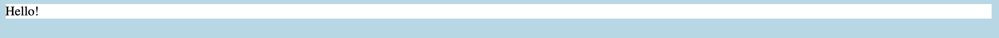

## Make a page template

<div style="display: flex; flex-wrap: wrap">
<div style="flex-basis: 200px; flex-grow: 1; margin-right: 15px;">
You're going to create a template for your website, that you will use to make the other pages.
</div>
<div>
[[Image, gif or video showing what they will achieve by the end of the step. {:width="300px"}]]
</div>
</div>

--- task ---

Open `template.html` and view the webpage.

The only tag in the `body` of the page is a `div` tag with the class `container`. You'll use CSS to add some style rules to make the `div` visible.

--- /task ---

To add your CSS, you need to link your stylesheet to `template.html`.

--- task ---

Add a link to `style.css` inside the `head` tag, like this:

```html
 <link rel="stylesheet" href="style.css">
```

--- /task ---

--- collapse ---
---
title: What about the stylesheet that's already there?
---
You may notice that there's already one stylesheet, called `company_style.css` linked to this page. This sheet contains some rules that you need to make the page look the way the company wants it, but which aren't what you're focusing on learning right now. You might have seen some of them before, and you'll learn others later. Pages can have lots of stylesheets, but you have to be careful that the rules don't contradict each other!

--- /collapse ---

The company wants a page layout that looks like this:


Use the CSS file you just linked to add some colour to the page.

--- task ---

In `style.css` add a rule that sets a background colour for the `body` tag, which will set that colour as the background for the whole page.

```css
body{
    background-color: lightblue;
}
```
**Choose:** Choose your own colour if you like. You can find a list on [this page](https://www.w3schools.com/colors/colors_names.asp).

--- save ---

**Test:** `template.html` has changed, view the page to see how.

--- /task ---

You still can't see the `container` `div` so now you will turn it into the white box from the company's design.

--- task ---

In `style.css` add a rule that sets a background colour for the `container` class, and a rule that sets the width of the `div` so it has those coloured borders either side of it.

```css
.container{
    background-color: white;
    width: 1200px;
}
```

**Choose:** Choose your own colour if you like. You can find a list on [this page](https://www.w3schools.com/colors/colors_names.asp).

--- save ---

**Test:** view `template.html` and see what's happened.

--- /task ---

It looks the same! This is because the `div` has no width, or height. If you add text to the `div`, it will use the width and height of the text.

--- task ---

Type some text into the `container` `div` in `template.html`:

```html
<div class="container">
    Hello!
</div>
```
--- save ---

**Test:** view `template.html` to check that your CSS rules are working.

--- /task ---

You should see something like this:



Now that you have the content box the company wants, you'll need to add the sections you're going to use in the rest of the template, and in making the pages based on it. These will also be `div` tags.

--- task ---

Create three new `div` tags inside of the `container` `div`. Each should have its own class:

  + Give the first `div` the `header` class.
  + Give the second `div` the `nav` (short for navigation) class.
  + Give the last `div` the `main` class.

The finished code should look like this:

```html
<div class="container">
    <div class="header">
        <!-- Page titles and the company logo go here -->
        Hello!
    </div>
    <div class="nav">
        <!-- The navigation menu goes here -->
        Hello!
    </div>
    <div class="main">
        <!-- The main content of the page goes here -->
        Hello!
    </div>
</div>
```

--- save ---

--- /task ---
