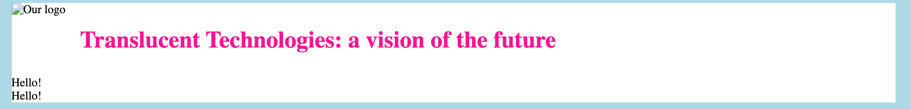

## Make a header

<div style="display: flex; flex-wrap: wrap">
<div style="flex-basis: 200px; flex-grow: 1; margin-right: 15px;">
You're going to add a header to your page template.
</div>
<div>

</div>
</div>

Creating this header will require two tags you've seen before: `h1` and `img`.

--- task ---

Add an image inside `header`. Give it the class `logo` and the alt-text 'Our logo'.

```html

```

<mark>Going to ask design to make a fun little logo asset here. It can be reused in the header art. Right now, it's a bit of stock photo.</mark>

**Choose:** Choose youre own logo, if you like. If you're not working in Trinket put the image in the same place as `template.html`.

--- save ---

**Test:** view `template.html` to see the logo.

--- /task ---

--- task ---

Below the image, add a level 1 heading inside `header`. Give it the class `title`.

```html
<h1 class="title">Translucent Technologies: a vision of the future</h1>
```

--- save ---

**Test:** view `template.html` to see the header and logo together.

--- /task ---

They're squashed together, and might look better if they had some colour.

--- task ---

In `style.css`, create a style rule for the `title` class that gives the heading a `deeppink` colour.

```css
.title{
    color: deeppink;
}
```

**Choose:** Choose your own colour if you like. You can find a list on [this page](https://www.w3schools.com/colors/colors_names.asp).

--- save ---

**Test:** view `template.html` to see the new header colour.

--- /task ---

Either the `logo` or the `title` class needs a rule that creates a gap between the heading and the logo. To do this, you can set the `margin` property on one of them.

--- task ---

In `style.css`, create a rule for the `logo` class that makes a gap to the right of the image.

```css
.logo{
    margin-right: 20px;
}
```

--- save ---

**Test:** view `template.html` to see the spacing.

--- /task ---
