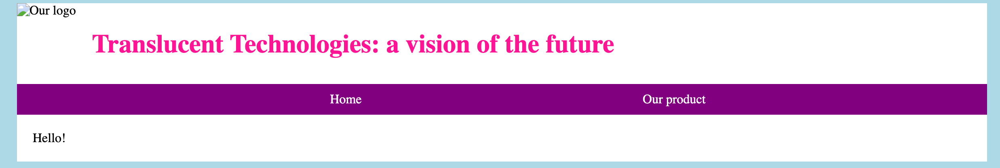

## Make a menu

<div style="display: flex; flex-wrap: wrap">
<div style="flex-basis: 200px; flex-grow: 1; margin-right: 15px;">
You're going to add a menu to your page template,so visitors to the website can find their way around.
</div>
<div>

</div>
</div>

Menus are made by using unordered lists (`ul`) of hyperlinks (`a`) and adding some special CSS rules. Links to pages inside your own site are called **relative** links. They are different to the **absolute** links you use to link to other websites on the internet.

<p style="border-left: solid; border-width:10px; border-color: #0faeb0; background-color: aliceblue; padding: 10px;">
<span style="color: #0faeb0">**Absolute links**</span> use the full address of a page, like `https://example.com/about.html`. This is like giving the full street address of a house — anyone can use that information to find it. 
</p>

<p style="border-left: solid; border-width:10px; border-color: #0faeb0; background-color: aliceblue; padding: 10px;">
<span style="color: #0faeb0">**Relative links**</span> include only the steps needed to get to a file from the file containing the link. If they're in the same directory, this is just the name of the file, like `about.html`. This is like giving someone directions to a house — 'take the second left, then the thrid right' — the directions only work for someone starting from that spot. They are used between pages in the same site so they don't need to be changed if the whole site gets moved around the internet.
</p>

--- task ---

Create a list of hyperlinks to the pages your site will have — the home page (`index.html`) and the product gallery (`product.html`) — inside the `nav` div. Give that list the `menu` class.

```html
<ul class="menu">
    <li>
        <a href="index.html">Home</a>
    </li>
    <li>
        <a href="product.html">Our product</a>
    </li>
</ul>
``` 
--- save ---

**Test:** view `template.html` to see the list.

--- /task ---

Thanks to some code in `company_style.css`, the links are going across, rather than down, the page. 

[[Image of same]]

The links still have the same style as they would in a paragraph of text. Use a little CSS to make them look different.

--- task ---

In `style.css` create a `menu` class and use it to set a background colour and turn off the bullet points on the list.

```css
.menu{
    background-color: purple;
    list-style-type: none;
}
```

**Choose:** Choose your own colour if you like. You can find a list on [this page](https://www.w3schools.com/colors/colors_names.asp).
--- /task ---

Change the colour of the text on the links, and get rid of the underlines. 

--- task ---

To only change links that are inside the `menu` div, you can use the **child selector**. 

```css
.menu a{
    color: white;
    text-decoration: none;
}
```

The space between `.menu` and `a` means 'child of'.

--- save ---

**Test:** view `template.html` to see your finished menu.

--- /task ---

<p style="border-left: solid; border-width:10px; border-color: #0faeb0; background-color: aliceblue; padding: 10px;">
<span style="color: #0faeb0">**Children**</span> of an element are all the elements that are inside it. In the code below, the `img` tag is the child of the `a` tag. The `a` tag could also be called the **parent** of the `img` tag.

```HTML
<a href="index.html">  </a>
```

</p>